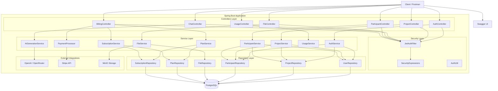
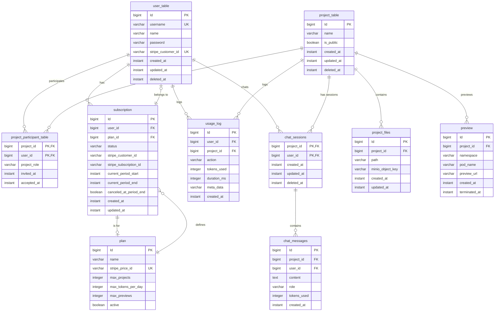
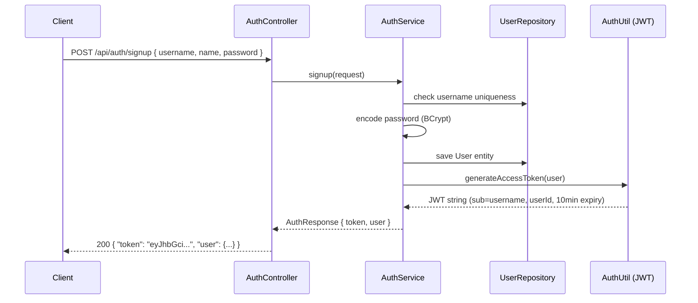
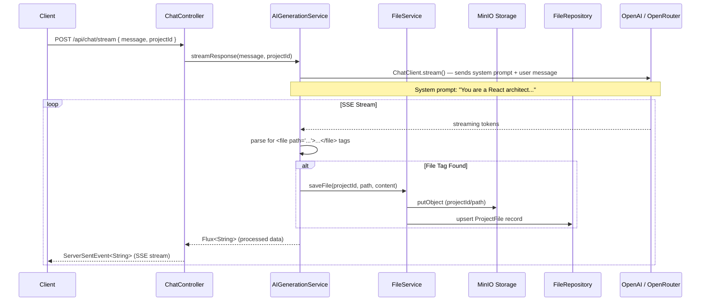
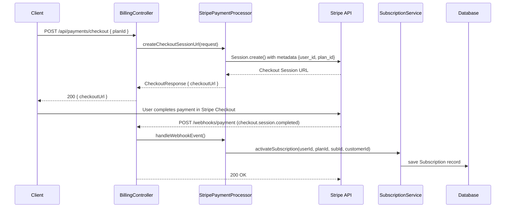

# PromptCraft — Project Summary

## Overview

**PromptCraft** is an AI-powered app builder (inspired by Lovable.dev) that lets users describe software projects in natural language and have an AI generate the code in real time. Built with Spring Boot 4, Java 21, and PostgreSQL.

---

## Tech Stack

| Category            | Technology                                      |
|---------------------|-------------------------------------------------|
| Framework           | Spring Boot 4.0.1, Spring MVC                   |
| Language            | Java 21                                         |
| Database            | PostgreSQL (via Spring Data JPA / Hibernate)    |
| Security            | Spring Security + JWT (jjwt 0.12.6)             |
| AI / LLM           | Spring AI (OpenAI / OpenRouter)                 |
| Payments            | Stripe (stripe-java 32.1.0)                     |
| File Storage        | MinIO (S3-compatible object storage)            |
| Object Mapping      | MapStruct 1.6.3                                 |
| Boilerplate        | Lombok                                          |
| API Documentation   | Springdoc OpenAPI (Swagger UI)                  |
| Build              | Maven                                           |

---

## Architecture



---

## Endpoints

### Auth — `/api/auth`

| Method | Path              | Request Body                                     | Response                  | Auth Required |
|--------|-------------------|--------------------------------------------------|---------------------------|---------------|
| POST   | `/api/auth/signup`| `{ "username", "name", "password" }`             | `AuthResponse` (token + user) | ❌         |
| POST   | `/api/auth/login` | `{ "username", "password" }`                     | `AuthResponse` (token + user) | ❌         |
| GET    | `/api/auth/me`    | —                                                | `UserProfileResponse`     | ❌ (hardcoded 1L) |

### Projects — `/api/projects`

| Method | Path                 | Request Body   | Response                        | Auth Required                          |
|--------|----------------------|----------------|---------------------------------|----------------------------------------|
| GET    | `/api/projects`      | —              | `List<ProjectSummaryResponse>`  | ❌ (commented out)                     |
| GET    | `/api/projects/{id}` | —              | `ProjectResponse`               | ✅ `@PreAuthorize("@security.canViewProject")` |
| POST   | `/api/projects`      | `{ "name" }`   | `ProjectResponse` (201)         | ❌ (no check)                          |
| PATCH  | `/api/projects/{id}` | `{ "name" }`   | `ProjectResponse`               | ✅ `@PreAuthorize("@security.canEditProject")` |
| DELETE | `/api/projects/{id}` | —              | 204                             | ✅ `@PreAuthorize("@security.canDeleteProject")` |

### Chat — `/api/chat/stream`

| Method | Path               | Request Body                         | Response                            | Auth Required |
|--------|--------------------|--------------------------------------|-------------------------------------|---------------|
| POST   | `/api/chat/stream` | `{ "message", "projectId" }`        | `Flux<ServerSentEvent<String>>` (SSE) | ✅ (in service layer) |

### Files — `/api/projects/{projectId}/files`

| Method | Path                                      | Response                    | Auth Required |
|--------|-------------------------------------------|-----------------------------|---------------|
| GET    | `/api/projects/{projectId}/files`         | `List<FileNode>`            | ❌ (hardcoded 1L) |
| GET    | `/api/projects/{projectId}/files/{*path}` | `FileContentResponse`       | ❌ (hardcoded 1L) |

### Participants — `/api/projects/{projectId}/members`

| Method | Path                                                        | Request Body                     | Response                  | Auth Required                                           |
|--------|-------------------------------------------------------------|----------------------------------|---------------------------|---------------------------------------------------------|
| GET    | `/api/projects/{projectId}/members`                         | —                                | `List<ParticipantResponse>` | ✅ `@PreAuthorize("@security.canViewMembers")`        |
| POST   | `/api/projects/{projectId}/members`                         | `{ "username", "role" }`        | `ParticipantResponse` (201) | ✅ `@PreAuthorize("@security.canManageMembers")`      |
| PATCH  | `/api/projects/{projectId}/members/{participantId}`         | `{ "role" }`                    | `ParticipantResponse`      | ✅ `@PreAuthorize("@security.canManageMembers")`      |
| DELETE | `/api/projects/{projectId}/members/{participantId}`         | —                                | 204                        | ✅ `@PreAuthorize("@security.canManageMembers")`      |

### Billing / Subscriptions

| Method | Path                          | Request Body                    | Response                     | Auth Required              |
|--------|-------------------------------|---------------------------------|------------------------------|----------------------------|
| GET    | `/api/plans`                  | —                               | `PlanResponse`               | ❌ Public                  |
| GET    | `/api/me/subscription`        | —                               | `SubscriptionResponse`       | ❌ (no auth extraction)    |
| POST   | `/api/payments/checkout`      | `{ "planId" }`                  | `CheckoutResponse` (Stripe URL) | ❌ (no auth extraction) |
| POST   | `/api/payments/portal`        | —                               | `PortalResponse` (Stripe URL)   | ❌ (no auth extraction) |
| POST   | `/webhooks/payment`           | Raw JSON + `Stripe-Signature` header | 200                       | ❌ Public (webhook)        |

### Usage — `/api/usage`

| Method | Path                    | Response                       | Auth Required              |
|--------|-------------------------|--------------------------------|----------------------------|
| GET    | `/api/usage/today`      | `UsageTodayResponse`           | ❌ (hardcoded 1L)          |
| GET    | `/api/usage/limits`     | `PlanLimitsResponse`           | ❌ (hardcoded 1L)          |

---

## Database Schema

### Entity Relationship Diagram



### Table Details

| Table                          | Key Columns & Notes                                                                 |
|--------------------------------|--------------------------------------------------------------------------------------|
| `user_table`                   | `id` PK, `username` (unique), `password` (bcrypt), `stripe_customer_id` (unique)    |
| `project_table`                | `id` PK, `name`, `is_public`, `deleted_at` for soft deletes. Indexes on `(updated_at DESC, deleted_at)` and `(deleted_at)` |
| `project_participant_table`    | Composite PK `(project_id, user_id)`, `project_role` enum (OWNER, EDITOR, VIEWER)   |
| `project_files`                | `id` PK, `project_id` FK → project, `path`, `minio_object_key` for object storage   |
| `plan`                         | `id` PK, `stripe_price_id` (unique), `max_projects`, `max_tokens_per_day`, `max_previews` |
| `subscription`                 | `id` PK, `user_id` FK, `plan_id` FK, `status` enum (ACTIVE, TRAILING, CANCELLED, PAST_DUE, INCOMPLETE) |
| `chat_sessions`                | Composite PK `(project_id, user_id)` — one session per user per project              |
| `chat_messages`                | `id` PK, FK to `chat_sessions` via `(project_id, user_id)`, `content` (text), `role` (USER, ASSISTANT, SYSTEM, TOOL) |
| `usage_log`                    | `id` PK, `user_id` FK, `project_id` FK, `action`, `tokens_used`, `duration_ms`      |
| `preview`                      | `id` PK, `project_id` FK, `namespace`/`pod_name` (Kubernetes), `preview_url`        |

---

## Enums

| Enum                | Values                                                      | Permission Mapping (ProjectRole → ProjectPermission) |
|---------------------|-------------------------------------------------------------|------------------------------------------------------|
| `ProjectRole`       | `OWNER`, `EDITOR`, `VIEWER`                                 | **OWNER**: VIEW, EDIT, DELETE, MANAGE_MEMBERS, VIEW_MEMBERS |
| `ProjectPermission` | `VIEW`, `EDIT`, `DELETE`, `MANAGE_MEMBERS`, `VIEW_MEMBERS`  | **EDITOR**: VIEW, EDIT                               |
| `SubscriptionStatus`| `ACTIVE`, `TRAILING`, `CANCELLED`, `PAST_DUE`, `INCOMPLETE`| **VIEWER**: VIEW                                     |
| `MessageRole`       | `USER`, `ASSISTANT`, `SYSTEM`, `TOOL`                       |                                                      |
| `PreviewStatus`     | `TERMINATED`, `CREATING`, `FAILED`, `RUNNING`               |                                                      |

---

## Key Workflows

### 1. Authentication Flow



### 2. Project Creation Flow

```mermaid
sequenceDiagram
    participant C as Client
    participant PC as ProjectController
    participant PS as ProjectService
    participant PR as ProjectRepository
    participant SR as SubscriptionRepository
    participant PAR as ParticipantRepository

    C->>PC: POST /api/projects { "name": "My App" }
    PC->>PS: createProject(request)
    PS->>SR: canCreateNewProject() — checks plan limits
    alt Over Project Limit
        PS-->>PC: throw exception
        PC-->>C: 400 / 403
    else Within Limit
        PS->>PR: save Project
        PS->>PAR: add OWNER participant (current user)
        PS-->>PC: ProjectResponse
        PC-->>C: 201 ProjectResponse
    end
```

### 3. AI Chat Streaming Flow



### 4. Collaboration (Invite Member)

```mermaid
sequenceDiagram
    participant C as Client
    participant PAC as ParticipantController
    participant PAS as ParticipantService
    participant PAR as ParticipantRepository
    participant UR as UserRepository

    C->>PAC: POST /api/projects/{projectId}/members { username, role }
    Note over C,PAC: Requires @PreAuthorize("@security.canManageMembers")
    PAC->>PAS: inviteParticipant(projectId, request)
    PAS->>UR: find user by username
    PAS->>PAR: create ProjectParticipant record
    PAS-->>PAC: ParticipantResponse
    PAC-->>C: 201 ParticipantResponse
```

### 5. Subscription & Payment Flow



---

## Current Implementation Status

| Component       | Status         | Notes                                                          |
|-----------------|----------------|----------------------------------------------------------------|
| Auth            | ✅ Implemented | Signup, login, JWT generation. `getProfile()` returns null.   |
| Projects        | ✅ Implemented | CRUD with soft delete. Plan limit check working.               |
| Chat (AI)       | ✅ Implemented | SSE streaming, file tag parsing, MinIO save. Needs API key.   |
| Files           | ⚠️ Partially   | `saveFile()` works. `getFileTree()` and `getFileContent()` are stubs returning null/empty. |
| Participants    | ✅ Implemented | Full CRUD with role-based permissions enforced.               |
| Plans           | ⚠️ Stub        | `getAllActivePlans()` returns null. Needs seed data or real query. |
| Subscriptions   | ✅ Implemented | CRUD methods, status transitions, project limit enforcement.  |
| Usage           | ⚠️ Stub        | `getTodayUsage()` and `getCurrentLimit()` return null.        |
| Payments        | ✅ Implemented | Stripe checkout, portal, webhook handling (5 event types).   |
| Previews        | ❌ Not started  | Entity exists, no service logic yet.                          |

### Known Issues & TODOs

- **AI API key misconfigured**: `application.yaml` has `ai.openai.api-key` set to a URL (`https://openrouter.ai/api`) instead of an actual API key. Set via environment variable.
- **Hardcoded userId=1L**: Several controllers use placeholder user IDs instead of extracting from JWT security context.
- **No seed data**: The `plan` table starts empty. Plans must be inserted manually into PostgreSQL for billing to work.
- **`ddl-auto: create`**: Schema is dropped and recreated on every restart — development only.
- **File service stubs**: `getFileTree` and `getFileContent` return null/empty.
- **Usage service stubs**: Usage tracking and plan limit queries return null.
- **JWT expiry**: Token expires in 10 minutes (`600` seconds in `AuthUtil`).

---

## Configuration Reference

```yaml
# src/main/resources/application.yaml
server:
  port: 8080

spring:
  datasource:
    url: jdbc:postgresql://localhost:5434/promptcraft
    username: promptcraft
    password: promptcraft123
  jpa:
    hibernate:
      ddl-auto: create    # Development only
    show-sql: true

jwt:
  secret-key: my-jwt-secret-key-which-is-hopefully-256-bits-long

stripe:
  api:
    secret: ${STRIPE_TEST_SECRET_KEY:sk_test_placeholder}
  webhook:
    secret: whsec_659523b32d50f5a69021628904449886b8188e01e2da64ac2ce0f2cd863a0aed

ai:
  openai:
    api-key: <REQUIRED: set via env var or update this field>
    chat:
      options:
        model: gpt-4    # or whatever model you want
        temperature: 0.0

client:
  url: http://localhost:8080/

minio:
  project-bucket: promptcraft-projects  # Used by FileServiceImpl
```

---

## Building & Running

```bash
# Prerequisites: Java 21, Maven, PostgreSQL (port 5434), MinIO

# Build
./mvnw clean compile

# Run
./mvnw spring-boot:run

# Tests
./mvnw test

# OpenAPI docs (when running)
# http://localhost:8080/swagger-ui.html
# http://localhost:8080/v3/api-docs
```
