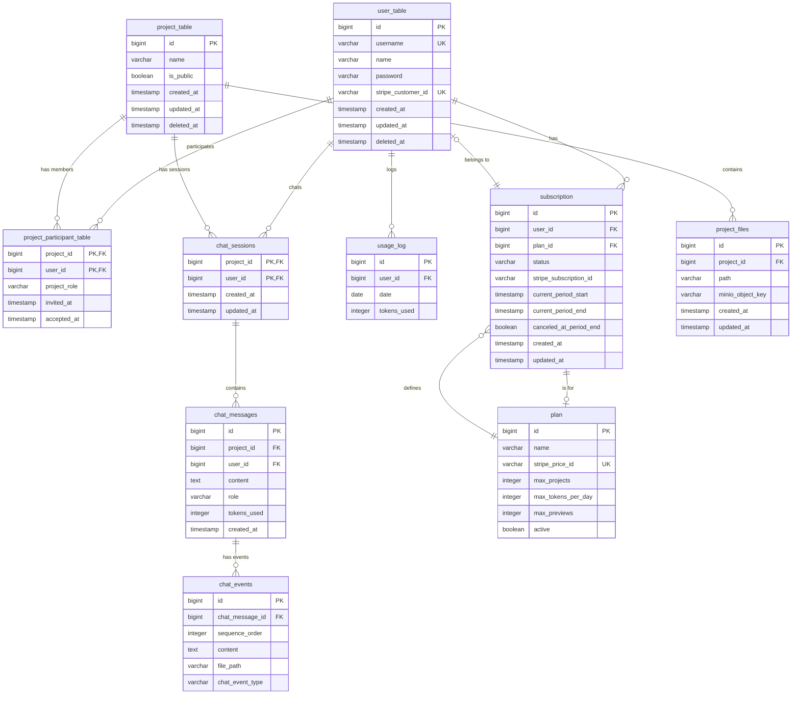
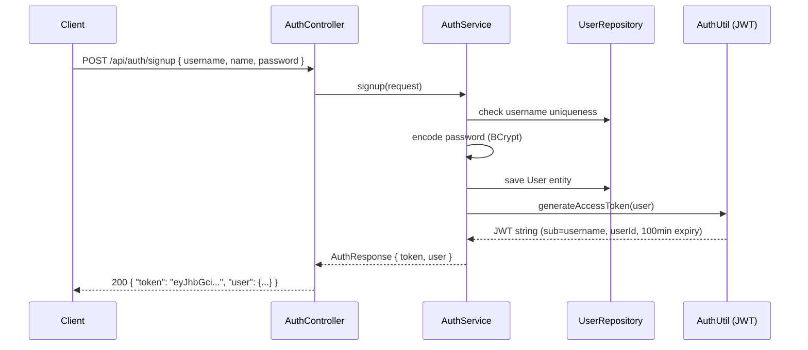
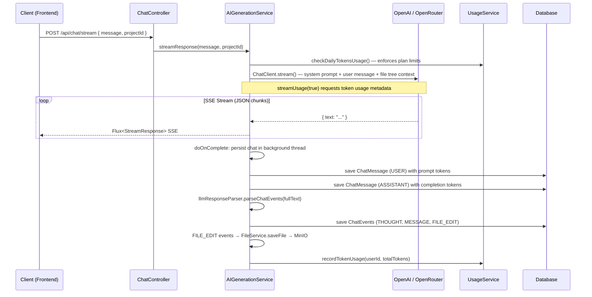
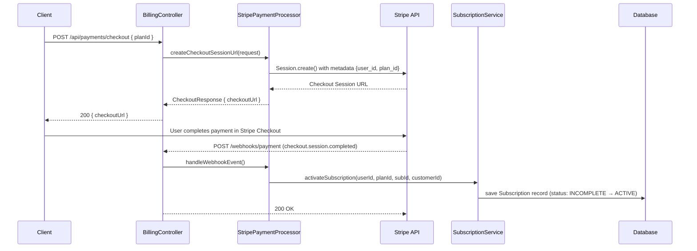

# PromptCraft — Project Summary

## Overview

**PromptCraft** is an AI-powered app builder (inspired by Lovable.dev) that lets users describe software projects in natural language and have an AI generate the code in real time. Built with Spring Boot 4.0.1, Java 21, and PostgreSQL.

---

## Tech Stack

| Category            | Technology                                      |
|---------------------|-------------------------------------------------|
| Framework           | Spring Boot 4.0.1, Spring MVC                   |
| Language            | Java 21                                         |
| Database            | PostgreSQL (via Spring Data JPA / Hibernate)    |
| Security            | Spring Security + JWT (jjwt 0.12.6)             |
| AI / LLM           | Spring AI (OpenAI / OpenRouter)                 |
| Payments            | Stripe (stripe-java 32.1.0)                     |
| File Storage        | MinIO (S3-compatible object storage)            |
| Object Mapping      | MapStruct 1.6.3                                 |
| Boilerplate        | Lombok                                          |
| API Documentation   | Springdoc OpenAPI (Swagger UI)                  |
| Build              | Maven                                           |

---

## Architecture


```mermaid
graph TD
    Client[Client / Postman]
    FE[Frontend :5173]
    SW[Swagger UI]

    subgraph "Spring Boot Application :8080"
        subgraph "Controllers Layer"
            AC[AuthController]
            PC[ProjectController]
            CC[ChatController]
            FC[FileController]
            PAC[ParticipantController]
            BC[BillingController]
            UC[UsageController]
        end

        subgraph "Security Layer"
            JWT[JwtAuthFilter]
            SEC[SecurityExpressions]
            AU[AuthUtil]
        end

        subgraph "Service Layer"
            AS[AuthService]
            PS[ProjectService]
            AGS[AIGenerationService]
            FS[FileService]
            PAS[ParticipantService]
            SS[SubscriptionService]
            US[UsageService]
            PPS[PaymentProcessor]
        end

        subgraph "Repository Layer"
            UR[UserRepository]
            PR[ProjectRepository]
            PAR[ParticipantRepository]
            FR[FileRepository]
            PLR[PlanRepository]
            SR[SubscriptionRepository]
            ULR[UsageLogRepository]
            CSR[ChatSessionRepository]
            CMR[ChatMessageRepository]
            CER[ChatEventRepository]
        end

        subgraph "External Integrations"
            AI[OpenAI / OpenRouter]
            STRIPE[Stripe API]
            MINIO[MinIO Storage]
        end
    end

    DB[(PostgreSQL)]

    Client --> AC & PC & CC & FC & PAC & BC & UC
    Client --> SW
    FE --> AC & PC & CC & FC & PAC & BC

    AC & PC & CC & FC & PAC & BC --> JWT
    JWT --> SEC

    AC --> AS
    PC --> PS
    CC --> AGS
    FC --> FS
    PAC --> PAS
    BC --> SS & PPS
    UC --> US

    AS & PS & PAS --> UR & PR & PAR
    SS --> PLR & SR
    FS --> FR
    US --> ULR
    AGS --> CSR & CMR & CER

    UR & PR & PAR & FR & PLR & SR & ULR & CSR & CMR & CER --> DB
    AGS --> AI
    PPS --> STRIPE
    FS --> MINIO
```

---

## Endpoints

### Auth — `/api/auth`

| Method | Path              | Request Body                                     | Response                  | Auth Required |
|--------|-------------------|--------------------------------------------------|---------------------------|---------------|
| POST   | `/api/auth/signup`| `{ "username", "name", "password" }`             | `AuthResponse` (token + user) | No         |
| POST   | `/api/auth/login` | `{ "username", "password" }`                     | `AuthResponse` (token + user) | No         |
| GET    | `/api/auth/me`    | —                                                | `UserProfileResponse`     | Yes (hardcoded userId=1L) |

### Projects — `/api/projects`

| Method | Path                 | Request Body   | Response                         | Auth Required                          |
|--------|----------------------|----------------|----------------------------------|----------------------------------------|
| GET    | `/api/projects`      | —              | `List<ProjectSummaryResponse>` (with role) | Yes |
| GET    | `/api/projects/{id}` | —              | `ProjectSummaryResponse` (with role) | Yes `@PreAuthorize("@security.canViewProject")` |
| POST   | `/api/projects`      | `{ "name" }`   | `ProjectResponse` (201)          | Yes `@PreAuthorize("@security.canEditProject")` |
| PATCH  | `/api/projects/{id}` | `{ "name" }`   | `ProjectResponse`                | Yes `@PreAuthorize("@security.canEditProject")` |
| DELETE | `/api/projects/{id}` | —              | 204                              | Yes `@PreAuthorize("@security.canDeleteProject")` |

### Chat — `/api/chat`

| Method | Path               | Request Body                         | Response                            | Auth Required |
|--------|--------------------|--------------------------------------|-------------------------------------|---------------|
| POST   | `/api/chat/stream` | `{ "message", "projectId" }`        | `Flux<StreamResponse>` (SSE, JSON)  | Yes (service layer) |

Each SSE chunk is a JSON object: `{ "text": "..." }`. Chat messages and events are persisted after the stream completes; AI-generated files are saved to MinIO via `ChatEvent` → `FILE_EDIT` → `FileService.saveFile()`.

### Files — `/api/projects/{projectId}/files`

| Method | Path                                             | Response                    | Auth Required |
|--------|--------------------------------------------------|-----------------------------|---------------|
| GET    | `/api/projects/{projectId}/files`                | `FileTreeResponse` (`{ files: [...] }`) | No (hardcoded userId=1L) |
| GET    | `/api/projects/{projectId}/files/content?path=...` | `FileContentResponse`     | No (hardcoded userId=1L) |

### Participants — `/api/projects/{projectId}/members`

| Method | Path                                                        | Request Body                     | Response                  | Auth Required                                           |
|--------|-------------------------------------------------------------|----------------------------------|---------------------------|---------------------------------------------------------|
| GET    | `/api/projects/{projectId}/members`                         | —                                | `List<ParticipantResponse>` | Yes `@PreAuthorize("@security.canViewMembers")`        |
| POST   | `/api/projects/{projectId}/members`                         | `{ "username", "role" }`        | `ParticipantResponse` (201) | Yes `@PreAuthorize("@security.canManageMembers")`      |
| PATCH  | `/api/projects/{projectId}/members/{participantId}`         | `{ "role" }`                    | `ParticipantResponse`      | Yes `@PreAuthorize("@security.canManageMembers")`      |
| DELETE | `/api/projects/{projectId}/members/{participantId}`         | —                                | 204                        | Yes `@PreAuthorize("@security.canManageMembers")`      |

### Billing / Subscriptions

| Method | Path                          | Request Body                    | Response                     | Auth Required              |
|--------|-------------------------------|---------------------------------|------------------------------|----------------------------|
| GET    | `/api/plans`                  | —                               | `List<PlanResponse>`         | No (returns seeded data)   |
| GET    | `/api/me/subscription`        | —                               | `SubscriptionResponse`       | Yes                        |
| POST   | `/api/payments/checkout`      | `{ "planId" }`                  | `CheckoutResponse` (Stripe URL) | Yes                   |
| POST   | `/api/payments/portal`        | —                               | `PortalResponse` (Stripe URL)   | Yes                   |
| POST   | `/webhooks/payment`           | Raw JSON + `Stripe-Signature` header | 200                       | No (webhook, public)       |

### Usage — `/api/usage`

| Method | Path                    | Response                       | Auth Required              |
|--------|-------------------------|--------------------------------|----------------------------|
| GET    | `/api/usage/today`      | `null` (stub, instructor parity) | No (hardcoded userId=1L) |

---

## Database Schema

### Entity Relationship Diagram


```mermaid
erDiagram
    user_table ||--o{ project_participant_table : "participates"
    user_table ||--o{ subscription : "has"
    user_table ||--o{ usage_log : "logs"
    user_table ||--o{ chat_sessions : "chats"

    project_table ||--o{ project_participant_table : "has members"
    project_table ||--o{ project_files : "contains"
    project_table ||--o{ chat_sessions : "has sessions"

    chat_sessions ||--o{ chat_messages : "contains"
    chat_messages ||--o{ chat_events : "has events"

    plan ||--o{ subscription : "defines"

    subscription ||--o| user_table : "belongs to"
    subscription ||--o| plan : "is for"

    user_table {
        bigint id PK
        varchar username UK
        varchar name
        varchar password
        varchar stripe_customer_id UK
        timestamp created_at
        timestamp updated_at
        timestamp deleted_at
    }

    project_table {
        bigint id PK
        varchar name
        boolean is_public
        timestamp created_at
        timestamp updated_at
        timestamp deleted_at
    }

    project_participant_table {
        bigint project_id PK,FK
        bigint user_id PK,FK
        varchar project_role
        timestamp invited_at
        timestamp accepted_at
    }

    project_files {
        bigint id PK
        bigint project_id FK
        varchar path
        varchar minio_object_key
        timestamp created_at
        timestamp updated_at
    }

    plan {
        bigint id PK
        varchar name
        varchar stripe_price_id UK
        integer max_projects
        integer max_tokens_per_day
        integer max_previews
        boolean active
    }

    subscription {
        bigint id PK
        bigint user_id FK
        bigint plan_id FK
        varchar status
        varchar stripe_subscription_id
        timestamp current_period_start
        timestamp current_period_end
        boolean canceled_at_period_end
        timestamp created_at
        timestamp updated_at
    }

    chat_sessions {
        bigint project_id PK,FK
        bigint user_id PK,FK
        timestamp created_at
        timestamp updated_at
    }

    chat_messages {
        bigint id PK
        bigint project_id FK
        bigint user_id FK
        text content
        varchar role
        integer tokens_used
        timestamp created_at
    }

    chat_events {
        bigint id PK
        bigint chat_message_id FK
        integer sequence_order
        text content
        varchar file_path
        varchar chat_event_type
    }

    usage_log {
        bigint id PK
        bigint user_id FK
        date date
        integer tokens_used
    }
```

### Table Details

| Table                          | Key Columns & Notes                                                                 |
|--------------------------------|--------------------------------------------------------------------------------------|
| `user_table`                   | `id` PK, `username` (unique), `password` (bcrypt), `stripe_customer_id` (unique)    |
| `project_table`                | `id` PK, `name`, `is_public`, `deleted_at` for soft deletes                          |
| `project_participant_table`    | Composite PK `(project_id, user_id)`, `project_role` enum (OWNER, EDITOR, VIEWER)   |
| `project_files`                | `id` PK, `project_id` FK, `path`, `minio_object_key` for MinIO object storage       |
| `plan`                         | `id` PK, `stripe_price_id` (unique), `max_projects`, `max_tokens_per_day`, `max_previews`, `active` |
| `subscription`                 | `id` PK, `user_id` FK, `plan_id` FK, `status` enum, `stripe_subscription_id`        |
| `chat_sessions`                | Composite PK `(project_id, user_id)` — one session per user per project              |
| `chat_messages`                | `id` PK, FK to `chat_sessions` via `(project_id, user_id)`, `content`, `role`, `tokens_used` |
| `chat_events`                  | `id` PK, `chat_message_id` FK, `sequence_order`, `content`, `file_path`, `chat_event_type` (THOUGHT, MESSAGE, TOOL_LOG, FILE_EDIT) |
| `usage_log`                    | `id` PK, `user_id` FK, `date`, `tokens_used` — one row per user per day             |

---

## Enums

| Enum                | Values                                                      |
|---------------------|-------------------------------------------------------------|
| `ProjectRole`       | `OWNER`, `EDITOR`, `VIEWER`                                 |
| `ProjectPermission` | `VIEW`, `EDIT`, `DELETE`, `MANAGE_MEMBERS`, `VIEW_MEMBERS`  |
| `SubscriptionStatus`| `ACTIVE`, `TRAILING`, `CANCELLED`, `PAST_DUE`, `INCOMPLETE`|
| `MessageRole`       | `USER`, `ASSISTANT`, `SYSTEM`, `TOOL`                       |
| `ChatEventType`     | `THOUGHT`, `MESSAGE`, `TOOL_LOG`, `FILE_EDIT`               |

---

## Key Workflows

### 1. Authentication Flow


```mermaid
sequenceDiagram
    participant C as Client
    participant AC as AuthController
    participant AS as AuthService
    participant UR as UserRepository
    participant JWT as AuthUtil (JWT)

    C->>AC: POST /api/auth/signup { username, name, password }
    AC->>AS: signup(request)
    AS->>UR: check username uniqueness
    AS->>AS: encode password (BCrypt)
    AS->>UR: save User entity
    AS->>JWT: generateAccessToken(user)
    JWT-->>AS: JWT string (sub=username, userId, 100min expiry)
    AS-->>AC: AuthResponse { token, user }
    AC-->>C: 200 { "token": "eyJhbGci...", "user": {...} }
```

### 2. Project Creation Flow

```mermaid
sequenceDiagram
    participant C as Client
    participant PC as ProjectController
    participant PS as ProjectService
    participant PR as ProjectRepository
    participant PAR as ParticipantRepository
    participant MINIO as MinIO Storage

    C->>PC: POST /api/projects { "name": "My App" }
    PC->>PS: createProject(request)
    PS->>PS: canCreateNewProject() — checks plan limits via subscription
    alt Over Project Limit
        PS-->>PC: throw exception
        PC-->>C: 400 / 403
    else Within Limit
        PS->>PR: save Project
        PS->>PAR: add OWNER participant (current user)
        PS->>MINIO: copy scaffold from starter/ to projects/{projectId}/
        PS-->>PC: ProjectResponse
        PC-->>C: 201 ProjectResponse
    end
```

### 3. AI Chat Streaming Flow


```mermaid
sequenceDiagram
    participant C as Client (Frontend)
    participant CC as ChatController
    participant AI as AIGenerationService
    participant LLM as OpenAI / OpenRouter
    participant US as UsageService
    participant DB as Database

    C->>CC: POST /api/chat/stream { message, projectId }
    CC->>AI: streamResponse(message, projectId)
    AI->>US: checkDailyTokensUsage() — enforces plan limits
    AI->>LLM: ChatClient.stream() — system prompt + user message + file tree context
    Note over AI,LLM: streamUsage(true) requests token usage metadata
    loop SSE Stream (JSON chunks)
        LLM-->>AI: { text: "..." }
        AI-->>C: Flux<StreamResponse> SSE
    end
    AI->>AI: doOnComplete: persist chat in background thread
    AI->>DB: save ChatMessage (USER) with prompt tokens
    AI->>DB: save ChatMessage (ASSISTANT) with completion tokens
    AI->>AI: llmResponseParser.parseChatEvents(fullText)
    AI->>DB: save ChatEvents (THOUGHT, MESSAGE, FILE_EDIT)
    AI->>AI: FILE_EDIT events → FileService.saveFile → MinIO
    AI->>US: recordTokenUsage(userId, totalTokens)
```

### 4. Subscription & Payment Flow


```mermaid
sequenceDiagram
    participant C as Client
    participant BC as BillingController
    participant SP as StripePaymentProcessor
    participant STRIPE as Stripe API
    participant SS as SubscriptionService
    participant DB as Database

    C->>BC: POST /api/payments/checkout { planId }
    BC->>SP: createCheckoutSessionUrl(request)
    SP->>STRIPE: Session.create() with metadata {user_id, plan_id}
    STRIPE-->>SP: Checkout Session URL
    SP-->>BC: CheckoutResponse { checkoutUrl }
    BC-->>C: 200 { checkoutUrl }

    C->>STRIPE: User completes payment in Stripe Checkout
    STRIPE-->>BC: POST /webhooks/payment (checkout.session.completed)
    BC->>SP: handleWebhookEvent()
    SP->>SS: activateSubscription(userId, planId, subId, customerId)
    SS->>DB: save Subscription record (status: INCOMPLETE → ACTIVE)
    BC-->>STRIPE: 200 OK
```

### 5. Collaboration (Invite Member)

```mermaid
sequenceDiagram
    participant C as Client
    participant PAC as ParticipantController
    participant PAS as ParticipantService
    participant PAR as ParticipantRepository
    participant UR as UserRepository

    C->>PAC: POST /api/projects/{projectId}/members { username, role }
    Note over C,PAC: Requires @PreAuthorize("@security.canManageMembers")
    PAC->>PAS: inviteParticipant(projectId, request)
    PAS->>UR: find user by username
    PAS->>PAR: create ProjectParticipant record
    PAS-->>PAC: ParticipantResponse
    PAC-->>C: 201 ParticipantResponse
```

---

## Configuration Reference

```yaml
# src/main/resources/application.yaml
server:
  port: 8080

spring:
  datasource:
    url: jdbc:postgresql://localhost:9010/pgvector-test
    username: user
    password: password
    driver-class-name: org.postgresql.Driver
  jpa:
    hibernate:
      ddl-auto: update
    show-sql: true
    properties:
      hibernate:
        format_sql: true
        dialect: org.hibernate.dialect.PostgreSQLDialect
  ai:
    openai:
      api-key: ${OPENROUTER_API_KEY:}
      base-url: https://openrouter.ai/api
      chat:
        options:
          model: google/gemini-3-flash-preview
          temperature: 0.0

jwt:
  secret-key: my-jwt-secret-key-which-is-hopefully-256-bits-long

stripe:
  api:
    secret: ${STRIPE_TEST_SECRET_KEY:sk_test_placeholder}
  webhook:
    secret: whsec_659523b32d50f5a69021628904449886b8188e01e2da64ac2ce0f2cd863a0aed

client:
  url: http://localhost:5173/

minio:
  url: http://localhost:9000
  access-key: minioadmin
  secret-key: minioadmin123
  project-bucket: projects
```

---

## Building & Running

### Prerequisites

- Java 21+
- Docker + Docker Compose
- Node.js 18+ (for frontend)
- Stripe CLI (for webhook testing): `brew install stripe`

### Step 1 — Start infrastructure

```bash
docker compose up -d
# PostgreSQL  -> localhost:9010 (db: pgvector-test, user/password: user/password)
# MinIO API   -> localhost:9000
# MinIO Admin -> http://localhost:9001 (minioadmin / minioadmin123)
```

If Docker containers were previously removed but volumes survived, `docker compose up -d` re-pulls images and remounts existing data (no data loss).

### Step 2 — Prepare MinIO (one-time)

The app does NOT auto-create buckets — project files are copied from a template:

1. Open http://localhost:9001 and log in with `minioadmin` / `minioadmin123`.
2. Create two buckets: `starter` and `projects`.
3. Upload a Vite/React scaffold into `starter` under the prefix
   `react-vite-tailwind-daisyui-starter/` (hardcoded in `ProjectTemplateServiceImpl`).
   On project creation these files are copied to `projects/{projectId}/...`.

### Step 3 — Seed plans table (one-time)

The `plan` table starts empty. Plans must be inserted for billing and project-limit enforcement to work:

```bash
docker exec pgvector-db-promptcraft psql -U user -d pgvector-test -c "
INSERT INTO plan (name, stripe_price_id, max_projects, max_tokens_per_day, max_previews, active)
VALUES ('Enterprise', 'price_1TXOMvFYAB1FYI6XL9Oceycf', 10, 999999999, 10, true);

INSERT INTO plan (name, stripe_price_id, max_projects, max_tokens_per_day, max_previews, active)
VALUES ('Pro', 'price_1TXOCmFYAB1FYI6Xgh8AXzV', 3, 50000, 3, true);
";
```

> **Note:** Price IDs are Stripe Price objects (not Product IDs). Enterprise has a
> very high token cap (999M/day, effectively unlimited); Pro enforces 50K/day.
> Adjust these values to match your Stripe dashboard.

### Step 4 — Configure env vars

```bash
export OPENROUTER_API_KEY=sk-or-v1-...   # required for AI chat
export STRIPE_TEST_SECRET_KEY=sk_test_... # required for Stripe checkout
```

> Both keys are read via env vars in `application.yaml` — no need to edit the file.
> The `OPENROUTER_API_KEY` must be non-empty for the app to boot (verified via context-load test).

### Step 5 — Run the backend

```bash
./mvnw spring-boot:run
# API: http://localhost:8080  (swagger: /swagger-ui.html, /v3/api-docs)
```

### Step 6 — Run the frontend

The course frontend (Vite + React + TS) lives in a separate repo and runs on its
own dev server. It calls the backend directly at `http://localhost:8080`
(hardcoded in `src/lib/api.ts`).

```bash
git clone https://github.com/Anuj-Kumar-Sharma/project-companion.git
cd project-companion
npm install
npm run dev
# Frontend: http://localhost:5173
```

### Step 7 — Run tests

```bash
export OPENROUTER_API_KEY=sk-or-v1-...   # required: context-load test boots the full app
./mvnw test
```

> Requires Postgres running (`docker compose up -d`). Tests run 5/5 (4 service
> unit tests + 1 context-load test).

> **Note:** `client.url` in `application.yaml` is `http://localhost:5173/` (the
> frontend dev server) — used for Stripe checkout redirects.

---

## Testing Workflow (End-to-End)

This section walks through every feature from start to finish.

### Phase 1 — Infrastructure & Auth

1. Start Docker: `docker compose up -d`
2. Verify Postgres: `docker exec pgvector-db-promptcraft pg_isready -U user -d pgvector-test`
3. Verify MinIO: open http://localhost:9001, confirm `starter` and `projects` buckets exist
4. Verify plans seeded: `docker exec pgvector-db-promptcraft psql -U user -d pgvector-test -c "SELECT id, name, stripe_price_id FROM plan;"`
5. Start backend: `export OPENROUTER_API_KEY=sk-or-v1-... && ./mvnw spring-boot:run`
6. Start frontend: `cd project-companion && npm run dev`
7. Sign up a new user in the frontend (POST `/api/auth/signup`)
8. Log in — JWT token stored in localStorage as `auth_token`

### Phase 2 — Project & Files

9. Create a project via the frontend → backend copies scaffold from MinIO `starter/` to `projects/{id}/`
10. Open the file tree in the frontend — should show the scaffold files
11. Click a file — content loads via `GET /api/projects/{id}/files/content?path=...`

### Phase 3 — AI Chat

12. Type a prompt in the chat → backend streams SSE responses (`{ "text": "..." }`)
13. After the stream completes, check the file tree — AI-generated files appear
14. Reload the page — chat history persists (messages + events)
15. Check `usage_log` table: `docker exec pgvector-db-promptcraft psql -U user -d pgvector-test -c "SELECT * FROM usage_log;"` — tokens should be recorded

### Phase 4 — Billing (Stripe)

16. Export Stripe test key: `export STRIPE_TEST_SECRET_KEY=sk_test_...`
17. Start Stripe CLI in a **separate terminal**:
    ```bash
    stripe listen --forward-to localhost:8080/webhooks/payment
    ```
    Copy the `whsec_...` signing secret it prints — update `application.yaml`
    `stripe.webhook.secret` with it (or restart the app).
18. Browse plans: `GET /api/plans` → returns Enterprise and Pro
19. Click "Subscribe" on a plan → redirects to Stripe Checkout
20. Complete checkout with test card: `4242 4242 4242 4242`, any future date, any CVC
21. Stripe fires webhooks → CLI forwards to local server → subscription created
22. Verify subscription: `GET /api/me/subscription` → shows ACTIVE status
23. Project creation now enforces plan limits (Enterprise: 10 projects, Pro: 3 projects)

### Phase 5 — Collaboration

24. Invite a member: `POST /api/projects/{id}/members { "username": "other_user", "role": "EDITOR" }`
25. Second user logs in and sees the project in their project list
26. Check permissions: VIEWER can read but not edit; EDITOR can edit but not delete

### Known Limitations (Instructor Parity)

- `GET /api/auth/me` returns userId=1L regardless of who is logged in (hardcoded stub)
- `GET /api/usage/today` returns null body (stub)
- Deploy and download-zip buttons in the frontend will error (not implemented)
- Free-tier users (no subscription) get 1 project allowed; limits enforce once billing is set up
- `checkDailyTokensUsage` returns early for users with no plan — token limits only enforce after a real subscription is created via Stripe checkout

---

## Current Implementation Status

| Component       | Status         | Notes                                                          |
|-----------------|----------------|----------------------------------------------------------------|
| Auth            | ✅ Implemented | Signup, login, JWT generation. `getProfile()` hardcoded to userId=1L. |
| Projects        | ✅ Implemented | CRUD with soft delete, plan-limit check, MinIO scaffold copy, role projection. |
| Chat (AI)       | ✅ Implemented | SSE streaming via `Flux<StreamResponse>`, `StreamUsage(true)`, chat events, usage tracking. |
| Files           | ✅ Implemented | `getFileTree()` returns `FileTreeResponse`, `getFileContent()` returns content via query param. |
| Participants    | ✅ Implemented | Full CRUD with role-based permissions enforced.               |
| Plans           | ✅ Seeded      | `getAllActivePlans()` is a stub but plan data is seeded in DB. |
| Subscriptions   | ✅ Implemented | Checkout, webhook activation, renewal, cancellation, status transitions. |
| Usage           | ✅ Implemented | `recordTokenUsage` / `checkDailyTokensUsage` wired into chat streaming. |
| Payments        | ✅ Implemented | Stripe checkout, portal, webhook handling.                    |
| Previews        | ❌ Not started | Entity exists, no service logic yet.                          |
